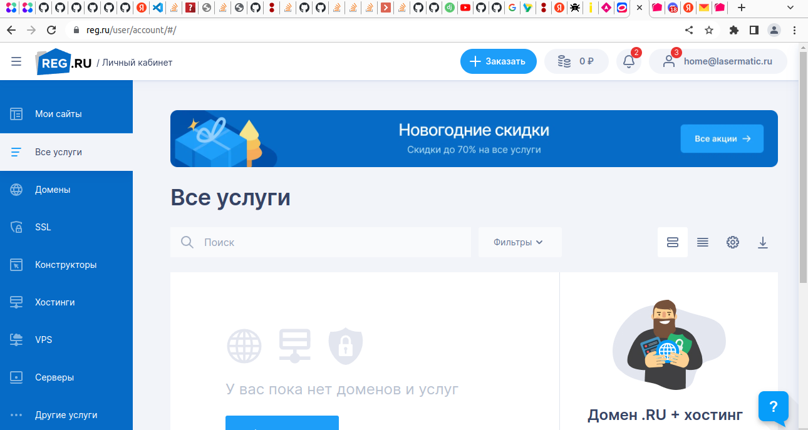

# Домашнее задание к лекции «Основы терминала»

Для выполнения практических заданий на курсе компания [REG.RU](https://www.reg.ru/) предоставляет виртуальные серверы с почасовой оплатой и сервисными функциями для разработчиков.


Каждый студент получает VPS в своём личном кабинете с бонусом в 500 рублей на балансе. Для экономии средств сервер можно включать в момент активной работы на нём и останавливать, когда работы на паузе, сохраняя данные и IP. Ошибки в процессе обучения — обычная ситуация. Если что-то пошло не так, легко восстановить нужное состояние сервера из снэпшота. На сервере можно будет сохранить все наработки по итогам курса.

## Задание 1

Подключиться к серверу на [reg.ru](https://www.reg.ru/) с помощью [ssh](https://losst.ru/kak-polzovatsya-ssh).

По шагам:

1. Получить доступ к учетной записи на reg.ru. Для этого нужно перейти по ссылке в личном кабинете Нетологии в разделе занятия "Доступ к VPS от Reg.ru" и зарегистрироваться на сайте. 

2. Установить терминал с ssh-клиентом:

- для ubuntu/fedora/centos/etc. - ssh-клиент уже установлен, ничего делать не надо
- для macOS - ssh-клиент уже установлен, ничего делать не надо
- для windows - рекомендуется установить [wsl 2](https://docs.microsoft.com/ru-ru/windows/wsl/install-win10)

3. Создать сервер в личном кабинете на reg.ru (подробности в [создание сервера на reg.ru](./new-server-reg-ru.md))

4. Узнать IP созданного сервера, логин и пароль пользователя на сервере (в своем личном кабинете).

5. Начать управление сервером с помощью ssh (ввести команду в своем терминале):

```bash
ssh имя_пользователя@ip_сервера
```

После этой команды терминал запросит у вас пароль от пользователя (при вводе пароль виден не будет - это сделано специально в целях безопасности).

В качестве результата прикрепите скриншот терминала, когда вы подключились к серверу.

Если у вас возникнут проблемы с настройкой, вы можете обратиться к [расширенной инструкции по управлению услугой "Облачные серверы"](https://www.reg.ru/support/vps-servery/oblachnie-serveri-vps/usluga-oblachnyye-servery/kak-sozdat-oblachnii-server-vps).

## Задание 2\* (необязательное)

Настройте свой ssh-клиент таким образом, чтобы можно было подключаться к серверу только такой командой (без ввода пароля):

```bash
ssh ваш_псевдоним_сервера
```

Подсказки:

1. Вам нужно узнать про `config` для ssh
2. Разобраться с командой `ssh-copy-id`


# Ответ:
Зарегистрировалась на reg.ru

Ссылку для активации доступа получить пока не удалось, поэтому работу выполнила на домашнем стенде.

Зашла по ssh на сервер 10.168.1.101 с логином tatyanix:
 
```shell
tatyanix@tatyanix-toshiba:~$ ssh tatyanix@10.168.1.101
The authenticity of host '10.168.1.101 (10.168.1.101)' can't be established.
ECDSA key fingerprint is SHA256:h03p98+XxxxXXXXxxXXxx4abrZP1uGvcXXXXXXXgI.
Are you sure you want to continue connecting (yes/no/[fingerprint])? yes
Warning: Permanently added '10.168.1.101' (ECDSA) to the list of known hosts.
tatyanix@10.168.1.101's password: 
Welcome to Ubuntu 20.04.4 LTS (GNU/Linux 5.4.0-122-generic x86_64)

 * Documentation:  https://help.ubuntu.com
 * Management:     https://landscape.canonical.com
 * Support:        https://ubuntu.com/advantage

  System information as of Вт 27 дек 2022 15:23:29 MSK

  System load:  0.0                Processes:               141
  Usage of /:   15.5% of 23.94GB   Users logged in:         1
  Memory usage: 6%                 IPv4 address for enp1s0: 10.168.1.101
  Swap usage:   0%

 * Strictly confined Kubernetes makes edge and IoT secure. Learn how MicroK8s
   just raised the bar for easy, resilient and secure K8s cluster deployment.

   https://ubuntu.com/engage/secure-kubernetes-at-the-edge

46 обновлений может быть применено немедленно.
27 из этих обновлений, являются стандартными обновлениями безопасности.
Чтобы просмотреть дополнительные обновления выполните: apt list --upgradable


The list of available updates is more than a week old.
To check for new updates run: sudo apt update
New release '22.04.1 LTS' available.
Run 'do-release-upgrade' to upgrade to it.


The programs included with the Ubuntu system are free software;
the exact distribution terms for each program are described in the
individual files in /usr/share/doc/*/copyright.

Ubuntu comes with ABSOLUTELY NO WARRANTY, to the extent permitted by
applicable law.


The programs included with the Ubuntu system are free software;
the exact distribution terms for each program are described in the
individual files in /usr/share/doc/*/copyright.

Ubuntu comes with ABSOLUTELY NO WARRANTY, to the extent permitted by
applicable law.

tatyanix@ubuntu-20:~$
```
Вышла по CTRL+D

Сгенерировала ssh ключ: 
```shell
tatyanix@tatyanix-toshiba:~$ ssh-keygen -t ed25519 -f .ssh/id_ed25519_netology
Generating public/private ed25519 key pair.
Enter passphrase (empty for no passphrase): 
Enter same passphrase again: 
Your identification has been saved in .ssh/id_ed25519_netology
Your public key has been saved in .ssh/id_ed25519_netology.pub
The key fingerprint is:
SHA256:XxXXXxX+xxXXXXxxxXXXXX+xxxxXXXX6xxxXXXXxxxXXX tatyanix@tatyanix-toshiba
The key's randomart image is:
+--[ED25519 256]--+
|  X  ..          |
|.  ..  . .       |
| x..    x        |
| .x  . ..        |
| .+..x=.X.       |
| ++x+xx+x        |
|.o+o=.+= .       |
|=..% =+.x        |
|.*X=X .x         |
+----[SHA256]-----+
```
Содержимое публичной части:
```shell
tatyanix@tatyanix-toshiba:~$ cat .ssh/id_ed25519_netology.pub 
ssh-ed25519 AAAAC3NzaC1lZDI1NTE5AAAAICfXmKXsokYgFgoN7klWwCP9bGoZPZIcJpcOe5yJ0+sj tatyanix@tatyanix-toshiba
```

С помощью утилиты ssh-copy-id скопировала публичную часть ключа на сервер:

```shell
tatyanix@tatyanix-toshiba:~$ ssh-copy-id -i .ssh/id_ed25519_netology.pub tatyanix@10.168.1.101
/usr/bin/ssh-copy-id: INFO: Source of key(s) to be installed: ".ssh/id_ed25519_netology.pub"
/usr/bin/ssh-copy-id: INFO: attempting to log in with the new key(s), to filter out any that are already installed
/usr/bin/ssh-copy-id: INFO: 1 key(s) remain to be installed -- if you are prompted now it is to install the new keys
tatyanix@10.168.1.101's password: 

Number of key(s) added: 1

Now try logging into the machine, with:   "ssh 'tatyanix@10.168.1.101'"
and check to make sure that only the key(s) you wanted were added.
```

Теперь войти можно без пароля:
```shell
tatyanix@tatyanix-toshiba:~$ ssh tatyanix@10.168.1.101
Welcome to Ubuntu 20.04.4 LTS (GNU/Linux 5.4.0-122-generic x86_64)

 * Documentation:  https://help.ubuntu.com
 * Management:     https://landscape.canonical.com
 * Support:        https://ubuntu.com/advantage

  System information as of Вт 27 дек 2022 16:07:44 MSK

  System load:  0.0                Processes:               135
  Usage of /:   15.5% of 23.94GB   Users logged in:         1
  Memory usage: 6%                 IPv4 address for enp1s0: 10.168.1.101
  Swap usage:   0%

 * Strictly confined Kubernetes makes edge and IoT secure. Learn how MicroK8s
   just raised the bar for easy, resilient and secure K8s cluster deployment.

   https://ubuntu.com/engage/secure-kubernetes-at-the-edge

46 обновлений может быть применено немедленно.
27 из этих обновлений, являются стандартными обновлениями безопасности.
Чтобы просмотреть дополнительные обновления выполните: apt list --upgradable


The list of available updates is more than a week old.
To check for new updates run: sudo apt update
New release '22.04.1 LTS' available.
Run 'do-release-upgrade' to upgrade to it.


Last login: Tue Dec 27 15:34:20 2022 from 10.168.1.104
tatyanix@ubuntu-20:~$ 
```
Для создания алиаса сервера в файле .ssh/config запишем:

```shell
tatyanix@tatyanix-toshiba:~$ cat .ssh/config
Host netology_lab
  HostName 10.168.1.101
  User tatyanix
```

Теперь войти можно по алиасу:

```shell
tatyanix@tatyanix-toshiba:~$ ssh netology_lab 
Welcome to Ubuntu 20.04.4 LTS (GNU/Linux 5.4.0-122-generic x86_64)

 * Documentation:  https://help.ubuntu.com
 * Management:     https://landscape.canonical.com
 * Support:        https://ubuntu.com/advantage

  System information as of Вт 27 дек 2022 16:16:47 MSK

  System load:  0.0                Processes:               135
  Usage of /:   15.5% of 23.94GB   Users logged in:         0
  Memory usage: 6%                 IPv4 address for enp1s0: 10.168.1.101
  Swap usage:   0%

 * Strictly confined Kubernetes makes edge and IoT secure. Learn how MicroK8s
   just raised the bar for easy, resilient and secure K8s cluster deployment.

   https://ubuntu.com/engage/secure-kubernetes-at-the-edge

46 обновлений может быть применено немедленно.
27 из этих обновлений, являются стандартными обновлениями безопасности.
Чтобы просмотреть дополнительные обновления выполните: apt list --upgradable


The list of available updates is more than a week old.
To check for new updates run: sudo apt update
New release '22.04.1 LTS' available.
Run 'do-release-upgrade' to upgrade to it.


Last login: Tue Dec 27 16:15:09 2022 from 10.168.1.104
tatyanix@ubuntu-20:~$ 
```
